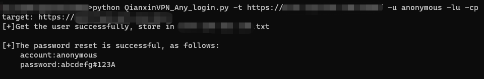
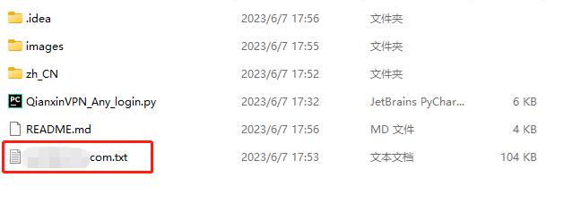
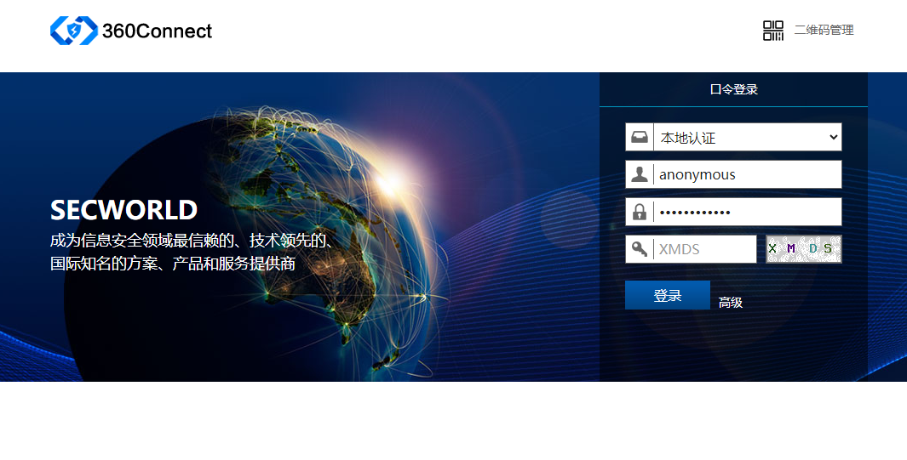
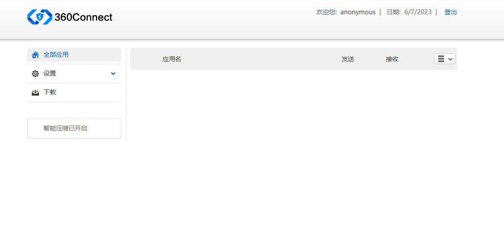

## Qi Anxin VPN directory traversal and any user login leak
### [中文](zh_CN%2FREADME.md)
### Disclaimer
This tool is only for legally authorized enterprise security construction activities. If you need to test the usability of this tool, please build a target machine environment by yourself. In order to avoid being used maliciously, all pocs included in this project are theoretical judgments of vulnerabilities, there is no process of exploiting vulnerabilities, and no real attacks and exploits will be launched on the target. When using this tool for detection, you should ensure that the behavior complies with local laws and regulations, and you have obtained sufficient authorization. Do not scan unauthorized targets. If you have any illegal acts during the use of this tool, you shall bear the corresponding consequences by yourself, and we will not bear any legal and joint liability. Before installing and using this tool, please be sure to carefully read and fully understand the content of each clause. Restrictions, exemption clauses or other clauses involving your major rights and interests may be bolded or underlined to remind you to pay attention. Unless you have fully read, fully understood and accepted all the terms of this agreement, please do not install and use this tool. Your use behavior or your acceptance of this agreement in any other express or implied way shall be deemed to have read and agreed to be bound by this agreement.
### Features
Secondary development of the tools shared by the master [利刃信安攻防实验室](https://mp.weixin.qq.com/s?__biz=MzU1Mjk3MDY1OA==&mid=2247504434&idx=1&sn=3d4c136cd108906a2cae0b1b6062013b&chksm=fbfb62ffcc8cebe9131cace98f21764ffb32599f033002d779a43ad9bc94b089f3f9a9e07dd2#rd):
```
1. Enhance the ability to discover vulnerabilities
2. Add batch scanning module
3. The output result is exported as text to make the result clearer
   Use the domain name as the text name, if it is a batch scan, each target has a separate text for display
```
### Look for
    fofa:
        app="奇安信-VPN"

    Other surveying and mapping:
        web.icon="84c7515970de0036f3719afb8c647ed6"
### Tutorial
#### Run
Use `python QianxinVPN_Any_login.py --help` to get help

```
Usage: QianxinVPN_Any_login.py [OPTIONS]

Options:
  -t, --target TEXT    Target
  -ts, --targets TEXT  multiple targets(-ts Specify your target file)
  -g, --group INTEGER  User Group
  -u, --user TEXT      Username(default user：anonymous)
  -p, --pwd TEXT       Password(default password：abcdefg#123A)
  -lu, --list-user
  -cp, --change-pwd
  --proxy TEXT
  --help               Show this message and exit.
``` 
##### Simple Usage
```
# Single target (-t) detection list users (-lu) and change passwords (-cp)
python3 QianxinVPN_Any_login.py -t https://x.xxx.xxx.cn/ -u anonymous -lu -cp

# Batch detection target (-ts) list user (-lu) and change password (-cp) -ts specify your target text
python3 QianxinVPN_Any_login.py -ts targets.txt -u anonymous -lu -cp
```

### Demo
#### Detect the specified target
Simple detection results are output in cmd  

  

At the same time, a target name.txt document will be created in the directory executed at the same time, which records detailed test data, such as: user, password  

  

Like this  

  

#### Detect multiple targets
Create target files, write your multiple targets  

  

Execute the detection command, and a simple detection result will be output for each target in cmd  

  

Also in the execution directory, there are detailed detection results for each target  

  


### Let's see the results
  

login successful  

  

### Thank you
Thanks [利刃信安攻防实验室](https://mp.weixin.qq.com/s?__biz=MzU1Mjk3MDY1OA==&mid=2247504434&idx=1&sn=3d4c136cd108906a2cae0b1b6062013b&chksm=fbfb62ffcc8cebe9131cace98f21764ffb32599f033002d779a43ad9bc94b089f3f9a9e07dd2#rd) master for sharing
### Suggestions and questions
If you have any suggestions and questions, please create lssues to contact me

